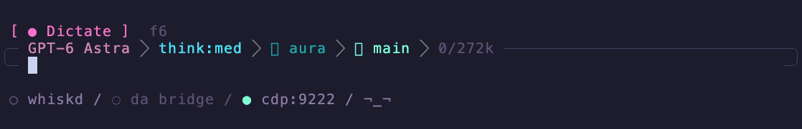

# aura

A [pi](https://github.com/badlogic/pi-mono) extension that gives the input frame an aura. It breathes with your music. It samples your Mac's system-audio loudness and glows the frame in time: dim when it's quiet, laser cyan through hot pink to white-hot when it's loud.

It works on stock pi with no other extensions. It does not replace the editor. Status colors and editor content stay untouched.

<p align="center">
  
</p>

macOS only. Everywhere else it's a silent no-op.


## Install

```bash
pi install https://github.com/Jeecabs/aura
```

### Local development

```bash
git clone https://github.com/Jeecabs/aura.git ~/.pi/agent/extensions/aura
cd ~/.pi/agent/extensions/aura
pnpm install
```

Reload pi if it's already running:

```text
/reload
```


## Use

```text
/aura          toggle the aura on/off
/aura on
/aura off
/aura status   show state and the current dB reading
/aura shader   toggle the Ghostty shader feed (opt-in)
```

The setting survives restarts. If it was on when you quit, it comes back on.


## Ghostty shader

Aura can also drive a [Ghostty custom shader](https://ghostty.org/docs/config/reference#custom-shader), so the whole window pulses and not just the input frame. It's opt-in:

1. Add the bundled shader to your Ghostty config, then reload the config:

   ```text
   custom-shader = ~/.pi/agent/git/github.com/Jeecabs/aura/shaders/aura.glsl
   ```

   That's where `pi install` puts it. For a local-dev clone, use `~/.pi/agent/extensions/aura/shaders/aura.glsl`.

2. In pi, run `/aura shader`. It needs `/aura` on as well.

Light spills in from the window edges and pools along the bottom, where pi's input frame sits, so the window and the frame read as one glow:

- **Loudness** sets how bright the light is and how far it reaches, using the frame's cyan, hot pink and white-hot ramp.
- **Beats** make it breathe a little.
- **Agent thinking** adds a slow violet breath, even in silence.
- **Tool errors** tint it red briefly.

Text stays crisp: glyphs only catch a hint of the light. Silence with an idle agent leaves the window untouched.

Ghostty shaders can't take custom inputs, so Aura writes these signals into palette slots 232-234 (OSC 4) about 30 times a second. The shader reads them back through `iPalette`; the layout is at the top of `shaders/aura.glsl`. Palette-only writes don't make pi redraw. Aura restores the slots when the shader is off, Aura is off or pi exits. While it's on, 256-color apps that use those slots see odd grays. Write your own shader against the same uniforms if you want a different look.


## Editor compatibility

Aura changes editor rendering only. On stock pi it supplies a compact rounded frame. If another extension already installed a custom editor, Aura wraps that editor and colors only the frame glyphs, so its input and status behavior stay intact.


## Requirements

- **Pi 0.84.x.** Editor wrapping and inter-extension decoration use the Pi 0.84 editor API.
- **macOS.** Audio capture uses ScreenCaptureKit; the extension does nothing on other platforms.
- **A truecolor terminal.** The frame only glows with 24-bit color. `/aura on` warns you if your terminal can't do it.
- **Swift toolchain** (`swiftc`, ships with Xcode / Command Line Tools). On first use it compiles a tiny helper.
- **Screen Recording permission.** ScreenCaptureKit captures system audio through the screen-recording API, so macOS will prompt for it the first time.


## How it works

On first run the extension writes a small Swift helper to a temp dir and compiles it with `swiftc` (cached by content hash, so it's a one-time cost). The helper opens a ScreenCaptureKit audio stream, computes RMS loudness per frame, and prints the dB level to stdout. The extension reads that stream and drives the glow.

System audio is heavily compressed, so a fixed dB→brightness mapping just pins the glow to white. Instead it runs an adaptive auto-gain: a slow floor and ceiling track the quiet and loud passages of whatever's playing, and each sample is mapped against that moving window. Fast attack on transients, gentle release, so the frame pulses with the beat instead of flickering.

There's only one honest signal here, loudness, so it's shown as one thing: intensity. No fake spectrum.


## Layout

| File | What it does |
| --- | --- |
| `src/index.ts` | The extension: `/aura`, auto-gain, and editor wrapping. |
| `src/editor-chrome.ts` | The shared rounded frame shape and frame-only glow renderer. |
| `src/system-audio.ts` | `SystemAudioSampler`, compiles and runs the Swift helper, exposes a `db()` reading. |
